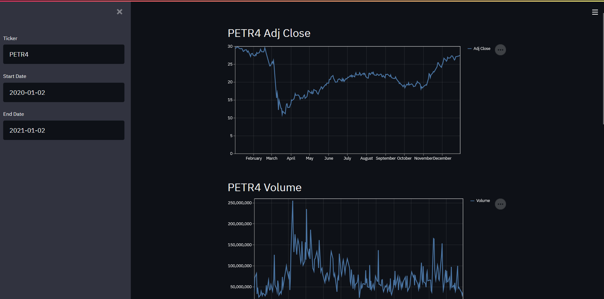

# Stock Webb App

Displays historical prices, volume and moving average in a Web interface. It only works for Brazilian stocks but its easy to modify the code to receive another kind of stocks. Using Streamlit you can add another indicators like another moving averages,relative strength index and fundamental indicators also improve the design interface.  

# Requirements

Streamlit  
Pandas  
Yahoo API fixer  

# Instructions

Make sure you have pandas, streamlit and fix_yahoo_finance installed.

To run the program, open your Command Prompt and run:
```{r}
streamlit run "path/stock_app.py"
```

Wait your default browser open the tab and then you will find a screen like this:



By default its set to look for Petrobras stocks prices and show its Adjusted Prices, Volume and 30 days Moving Average from 2020-01-02 to 2021-01-02. If want to look for another company or another range of time, change it,press enter and let Yahoo's API work.

You can save any graph just clicking on the three shadowed dots on the right superior corner of the desired graph and selecting 'Save as PNG' and downloading it.

# How to improve it

The basic building block to display a raw series is:

```{r}
st.header('Title') ### Replace 'Ttile' for the desired title
st.write(series) ### Refer the series you want to display
```

To display a line graph of the series:

```{r}
st.header('Title')
st.line_chart(series)
```

Look for Streamlit documentation for different types of graphs.

# Conclusion

When I started to learn how to code I thought that was hard to build an interactive and useful interface but as you could see this not the case because there are many modules that can help you. Hope this code help you!

# Warnings!

-There is no error/exception handling in the code so pay attention when you insert the ticker, start and end date(be sure that it makes sense!).

-It uses the Yahoo Finance API to gather the information so its restricted data range and platform availability.

# References


https://docs.streamlit.io/en/stable/

https://www.youtube.com/watch?v=eNDADqa9858

https://www.youtube.com/watch?v=hngHA9Jjbjc&t=586s

But you can find more easily!


